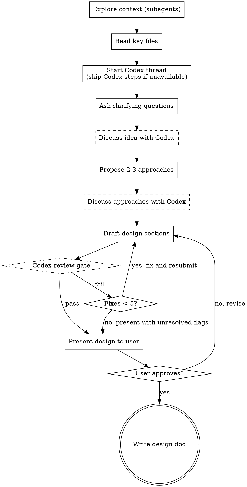

# Brainstorming Ideas Into Designs

## Overview

Help turn ideas into fully formed designs and specs through natural collaborative dialogue.

Start by understanding the current project context, then ask questions one at a time to refine the idea. Once you understand what you're building, present the design and get user approval.

<HARD-GATE>
Do NOT invoke any implementation skill, write any code, scaffold any project, or take any implementation action until you have presented a design and the user has approved it. This applies to EVERY project regardless of perceived simplicity.
</HARD-GATE>

## Anti-Pattern: "This Is Too Simple To Need A Design"

Every project goes through this process. A todo list, a single-function utility, a config change — all of them. "Simple" projects are where unexamined assumptions cause the most wasted work. The design can be short (a few sentences for truly simple projects), but you MUST present it and get approval.

## Codex Integration

> See `lib/codex-integration.md` for Codex patterns. All interactions go through the codex-agent (`agents/codex-agent.md`).

Codex is a reviewer and thought partner throughout brainstorming.

**Thread management:**
- At the start of brainstorming, dispatch codex-agent with `mode: create-thread` and a context message summarizing the project and mission.
- The agent handles thread creation, state file persistence, and `.codex-state/` setup.
- All subsequent Codex interactions dispatch codex-agent with `mode: discuss` or `mode: review-gate`.

**Codex availability:**
If the codex-agent reports `status: unavailable`, skip all Codex steps and proceed without Codex review. Inform the user that Codex review was skipped and why.

**Codex is consulted at three points:**
1. **After idea exploration** — Dispatch codex-agent with `mode: discuss` to validate understanding and surface blind spots. The agent verifies Codex's claims against the codebase before returning.
2. **After exploring approaches** — Dispatch codex-agent with `mode: discuss` sharing proposed approaches. If the agent reports that Codex recommends a different approach, present both recommendations to the user with clear attribution (e.g., "I recommend A because X. Codex recommends B because Y.").
3. **Before presenting design to user** — Dispatch codex-agent with `mode: review-gate` for design review. If verdict is `fail`, fix issues and redispatch (max 5 rounds). The agent filters out false positives so only verified issues come back.

## Checklist

You MUST create a task for each of these items and complete them in order:

1. **Explore project context** — launch 2-3 subagent code-explorers in parallel (see "Codebase Exploration")
2. **Read key files** — read all files identified by the explorer agents to build deep understanding
3. **Start Codex thread** — dispatch codex-agent with `mode: create-thread` and project context + mission
4. **Ask clarifying questions** — one at a time, understand purpose/constraints/success criteria
5. **Discuss refined idea with Codex** — dispatch codex-agent with `mode: discuss`, validate understanding and surface blind spots
6. **Propose 2-3 approaches** — with trade-offs and your recommendation
7. **Discuss approaches with Codex** — dispatch codex-agent with `mode: discuss`, if recommendations differ, note both for user
8. **Codex review gate** — dispatch codex-agent with `mode: review-gate`, iterate up to 5 rounds (see `lib/codex-integration.md`)
9. **Present final design to user** — include any unresolved Codex flags if review gate did not fully pass
10. **Write design doc** — save to `docs/plans/YYYY-MM-DD-<topic>-design.md`, commit, and write breadcrumb to `.codex-state/current_design_doc`

## Process Flow



> Dashed nodes are skipped when Codex is unavailable. The flow proceeds linearly without them.

**The terminal state is the committed design doc.** Do NOT invoke any implementation skill. The user manually proceeds from here.

## The Process

### Codebase Exploration

**Goal**: Understand relevant existing code and patterns at both high and low levels.

**Actions**:
1. Launch 2-3 code-explorer `subagent`s in parallel. Each agent should:
   - Trace through the code comprehensively and focus on getting a comprehensive understanding of abstractions, architecture and flow of control
   - Target a different aspect of the codebase (e.g., similar features, high level understanding, architectural understanding, user experience, etc.)
   - Include a list of 5-10 key files to read

   **Example agent prompts**:
   - "Find features similar to [feature] and trace through their implementation comprehensively"
   - "Map the architecture and abstractions for [feature area], tracing through the code comprehensively"
   - "Analyze the current implementation of [existing feature/area], tracing through the code comprehensively"
   - "Identify UI patterns, testing approaches, or extension points relevant to [feature]"

2. Once the agents return, read all files identified by agents to build deep understanding
3. Present comprehensive summary of findings and patterns discovered

### Starting the Codex Thread

- Dispatch codex-agent with `mode: create-thread` and context containing:
  - Summary of the project context gathered by subagents
  - The user's idea/request
  - Codex's role: reviewer and thought partner for this brainstorming session
- The agent handles thread creation, state file persistence, and `.codex-state/` setup
- If the agent reports `status: unavailable`, inform the user and proceed without Codex for the rest of the session

### Understanding the Idea

- Ask questions one at a time to refine the idea
- Prefer multiple choice questions when possible, but open-ended is fine too
- Only one question per message — if a topic needs more exploration, break it into multiple questions
- Focus on understanding: purpose, constraints, success criteria
- After questions are resolved, dispatch codex-agent with `mode: discuss` to validate understanding and surface blind spots

### Exploring Approaches

- Propose 2-3 different approaches with trade-offs
- Present options conversationally with your recommendation and reasoning
- Lead with your recommended option and explain why
- Dispatch codex-agent with `mode: discuss` to discuss approaches with Codex
- If you and Codex recommend different approaches, tell the user: "I recommend [approach] because [reason]. Codex recommends [approach] because [reason]."

### Presenting the Design

- Draft the design internally first
- Dispatch codex-agent with `mode: review-gate` before showing to user
- If verdict is `fail`, fix verified issues and redispatch (up to 5 rounds). False positives are already filtered by the agent.
- Once codex-agent returns `pass` or `pass-with-flags` (or 5 rounds exhausted), present to user
- If presenting with unresolved Codex flags, clearly list what remains unresolved
- Scale each section to its complexity: a few sentences if straightforward, up to 200-300 words if nuanced
- Ask after each section whether it looks right so far
- Cover: architecture, components, data flow, error handling, testing
- Be ready to go back and clarify if something doesn't make sense

## After the Design

**Documentation:**
- Write the validated design to `docs/plans/YYYY-MM-DD-<topic>-design.md`
- Use elements-of-style:writing-clearly-and-concisely skill if available
- Commit the design document to git
- Write breadcrumb:
```bash
MAIN_REPO="$(cd "$(git rev-parse --git-common-dir)/.." && pwd)"
echo "docs/plans/YYYY-MM-DD-<topic>-design.md" > "$MAIN_REPO/.codex-state/current_design_doc"
```

**Brainstorming ends here.** The user manually starts a new session for planning. (Rationale: brainstorming consumes most of the context window; a fresh session for writing-plans avoids compaction-induced context loss.)

## Key Principles

- **One question at a time** — Don't overwhelm with multiple questions
- **Multiple choice preferred** — Easier to answer than open-ended when possible
- **YAGNI ruthlessly** — Remove unnecessary features from all designs
- **Explore alternatives** — Always propose 2-3 approaches before settling
- **Incremental validation** — Present design, get approval before moving on
- **Be flexible** — Go back and clarify when something doesn't make sense
- **Codex as second opinion** — Use Codex to catch blind spots, not as a blocker
- **Transparency** — Always tell the user when you and Codex disagree
- **Graceful degradation** — If Codex is unavailable, proceed without it
