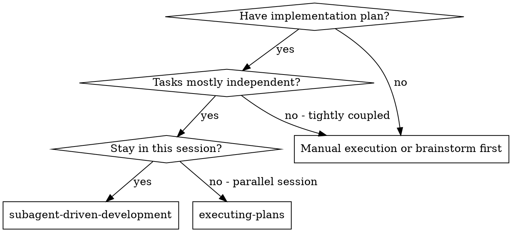
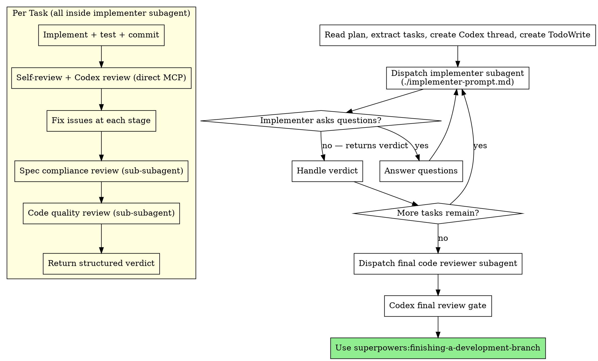

# Subagent-Driven Development

Execute plan by dispatching fresh implementer subagent per task. Each implementer handles the full lifecycle: implement → self-review → Codex review → spec compliance → code quality → fix → report verdict. Main session only dispatches and tracks progress.

**Core principle:** Fresh subagent per task with full review pipeline built in = high quality, minimal main session context usage

## When to Use



**vs. Executing Plans (parallel session):**
- Same session (no context switch)
- Fresh subagent per task (no context pollution)
- Full review pipeline inside each subagent (self-review → Codex → spec → quality)
- Faster iteration (no human-in-loop between tasks)

## Setup

Before dispatching the first task:

1. **Find and read plan file** — the user may have cleared the session, so discover the plan:
   - **Check breadcrumb first:**
     ```bash
     MAIN_REPO="$(cd "$(git rev-parse --git-common-dir)/.." && pwd)"
     PLAN_PATH="$MAIN_REPO/$(cat "$MAIN_REPO/.codex-state/current_plan" 2>/dev/null)"
     ```
   - **If breadcrumb missing or file not found:** scan `docs/superpowers/plans/` for the most recent plan file (by filename date prefix or modification time)
   - **If multiple candidates:** ask the user which one
   - Read the plan file and extract all tasks with full text and context
2. **Create TodoWrite** with all tasks
3. **Create a Codex thread** for per-task reviews (shared across tasks):
   ```
   Agent tool:
     subagent_type: "superpowers:codex-agent"
     description: "Init Codex thread for implementation"
     prompt: |
       mode: init
       profile: higheffort
   ```
   Save the returned `thread_id`. Pass it to all implementer subagents as `CODEX_THREAD_ID`.
   If codex-agent reports `status: unavailable`, set `CODEX_STATUS: unavailable` and `CODEX_THREAD_ID: none`.
4. **Record BASE_SHA** — the commit before the first task: `git rev-parse HEAD`

## The Process



**Yellow box runs entirely inside the implementer subagent.** The main session only sees the dispatch and the final verdict — all reviews, fixes, and re-reviews stay out of the main session's context.

## Model Selection

Use the least powerful model that can handle each role to conserve cost and increase speed.

**Mechanical implementation tasks** (isolated functions, clear specs, 1-2 files): use a fast, cheap model. Most implementation tasks are mechanical when the plan is well-specified.

**Integration and judgment tasks** (multi-file coordination, pattern matching, debugging): use a standard model.

**Architecture, design, and review tasks**: use the most capable available model.

**Task complexity signals:**
- Touches 1-2 files with a complete spec → cheap model
- Touches multiple files with integration concerns → standard model
- Requires design judgment or broad codebase understanding → most capable model

## Handling Implementer Verdicts

Implementer subagents return a structured verdict after completing their full review pipeline. Handle each:

**`pass`:** All reviews passed. Mark task complete in TodoWrite. Proceed to next task.

**`fail`:** One or more review stages have unresolved issues. Read the unresolved items. Assess:
- If fixable with more context: re-dispatch with additional context
- If the task is too complex: re-dispatch with a more capable model
- If the plan itself is wrong: escalate to the human

**`needs_context`:** The implementer needs information before starting. Provide the missing context and re-dispatch.

**`blocked`:** The implementer cannot complete the task. Assess the blocker:
1. If it's a context problem, provide more context and re-dispatch
2. If the task requires more reasoning, re-dispatch with a more capable model
3. If the task is too large, break it into smaller pieces
4. If the plan itself is wrong, escalate to the human

**Never** ignore an escalation or force the same model to retry without changes.

## Prompt Templates

- `./implementer-prompt.md` - Dispatch implementer subagent (includes full review pipeline)
- `./spec-reviewer-prompt.md` - Spec compliance reviewer (dispatched by implementer as sub-subagent)
- `./code-quality-reviewer-prompt.md` - Code quality reviewer (dispatched by implementer as sub-subagent)

## Example Workflow

```
You: I'm using Subagent-Driven Development to execute this plan.

[Read plan file once: docs/superpowers/plans/feature-plan.md]
[Extract all 5 tasks with full text and context]
[Create Codex thread via codex-agent init → thread_id: sess_abc123]
[Create TodoWrite with all tasks]
[Record BASE_SHA]

Task 1: Hook installation script

[Dispatch implementer with full task text + context + CODEX_THREAD_ID]

Implementer: "Before I begin - should the hook be installed at user or system level?"

You: "User level (~/.config/superpowers/hooks/)"

[Re-dispatch implementer with answer]

Implementer returns verdict:
  task: 1
  verdict: pass
  implementation_summary: Added install-hook command with --force flag
  codex_review: available, 1 round, 0 findings
  spec_compliance: pass (round 1)
  code_quality: pass (round 1)
  tests: 5/5 passing

[Mark Task 1 complete]

Task 2: Recovery modes

[Dispatch implementer with full task text + context + CODEX_THREAD_ID]

Implementer returns verdict:
  task: 2
  verdict: pass
  implementation_summary: Added verify/repair modes with progress reporting
  codex_review: available, 2 rounds, 1 finding fixed
  spec_compliance: pass (round 2 — fixed missing progress reporting, removed extra --json flag)
  code_quality: pass (round 2 — extracted PROGRESS_INTERVAL constant)
  tests: 8/8 passing

[Mark Task 2 complete]

... (tasks 3-5)

[After all tasks]
[Dispatch final code-reviewer subagent]
[Dispatch Codex final review]
Final reviewer + Codex: All requirements met, ready to merge

[Use superpowers:finishing-a-development-branch]
```

**Notice:** The main session only sees dispatch + verdict per task. All review rounds, fixes, and re-reviews happen inside the implementer subagent.

## Codex Review Gates

See `lib/codex-integration.md` for full protocol.

**Per-task Codex reviews** run inside each implementer subagent (direct MCP calls to `codex-reply`). The main session creates one Codex thread at setup and passes it to all implementers. Per-task reviews catch issues within each task (security, correctness, test gaps).

**The final Codex review** runs in the main session after all tasks complete. It catches cross-cutting issues across the full implementation.

### Final Codex Review

After the final code-reviewer subagent passes, run a Codex final review:

1. Get commit SHAs covering all implementation (from first task to HEAD)
2. Dispatch codex-agent (foreground):
   ```
   Agent tool:
     subagent_type: "superpowers:codex-agent"
     description: "Codex final review"
     prompt: |
       mode: review-gate
       thread_id: "new"
       message: |
         Final review of complete implementation.
         Commits: <FIRST_TASK_SHA>..<HEAD_SHA>
         Summary: <what the full plan implemented>
         Tests: <all tests pass/fail summary>
       context: Full implementation of <plan-file-path>
       worktree_path: <worktree-path>
       profile: xhigheffort
   ```
3. Echo `**Active Codex thread_id:** <id>`
4. If `pass`: proceed to finishing-a-development-branch
5. If `fail`: **independently verify each finding** — read the actual code at the cited location and confirm the issue exists. Dismiss false positives. Fix confirmed issues, then redispatch. Max 5 rounds.
6. Track any unresolved flags in `docs/unresolved-flags.md`

## Advantages

**vs. Manual execution:**
- Subagents follow TDD naturally
- Fresh context per task (no confusion)
- Subagent can ask questions (before AND during work)

**vs. Executing Plans:**
- Same session (no handoff)
- Continuous progress (no waiting)
- Full review pipeline automatic

**Context efficiency:**
- Main session only holds dispatch + verdict per task
- All reviews, fixes, and re-reviews stay inside the implementer subagent
- For 15 tasks: ~15 subagent interactions in main context instead of 60+
- No file reading overhead (controller provides full text)

**Quality gates (all inside implementer):**
- Self-review catches issues first
- Codex review catches security, correctness, test gaps
- Spec compliance prevents over/under-building
- Code quality ensures implementation is well-built
- Fix loops at each stage ensure issues are resolved before moving on

## Red Flags

**Never:**
- Start implementation on main/master branch without explicit user consent
- Dispatch multiple implementation subagents in parallel (conflicts)
- Make subagent read plan file (provide full text instead)
- Skip scene-setting context (subagent needs to understand where task fits)
- Ignore subagent questions (answer before letting them proceed)
- Mark a task complete if verdict is `fail` — address unresolved issues first
- Fix code in the main session — always re-dispatch a subagent (context pollution)

**If subagent asks questions:**
- Answer clearly and completely
- Provide additional context if needed
- Re-dispatch with the answer

**If verdict is `fail`:**
- Read the unresolved items
- Assess whether more context, a more capable model, or plan changes are needed
- Re-dispatch or escalate — don't ignore

## Integration

**Required workflow skills:**
- **superpowers:using-git-worktrees** - REQUIRED: Set up isolated workspace before starting
- **superpowers:writing-plans** - Creates the plan this skill executes
- **superpowers:requesting-code-review** - Code review template for reviewer subagents
- **superpowers:finishing-a-development-branch** - Complete development after all tasks

**Subagents should use:**
- **superpowers:test-driven-development** - Subagents follow TDD for each task

**Alternative workflow:**
- **superpowers:executing-plans** - Use for parallel session instead of same-session execution
