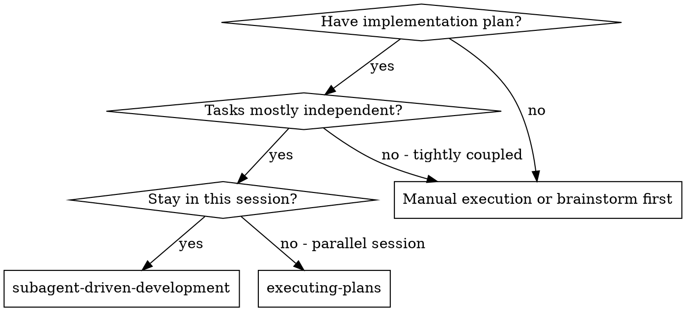
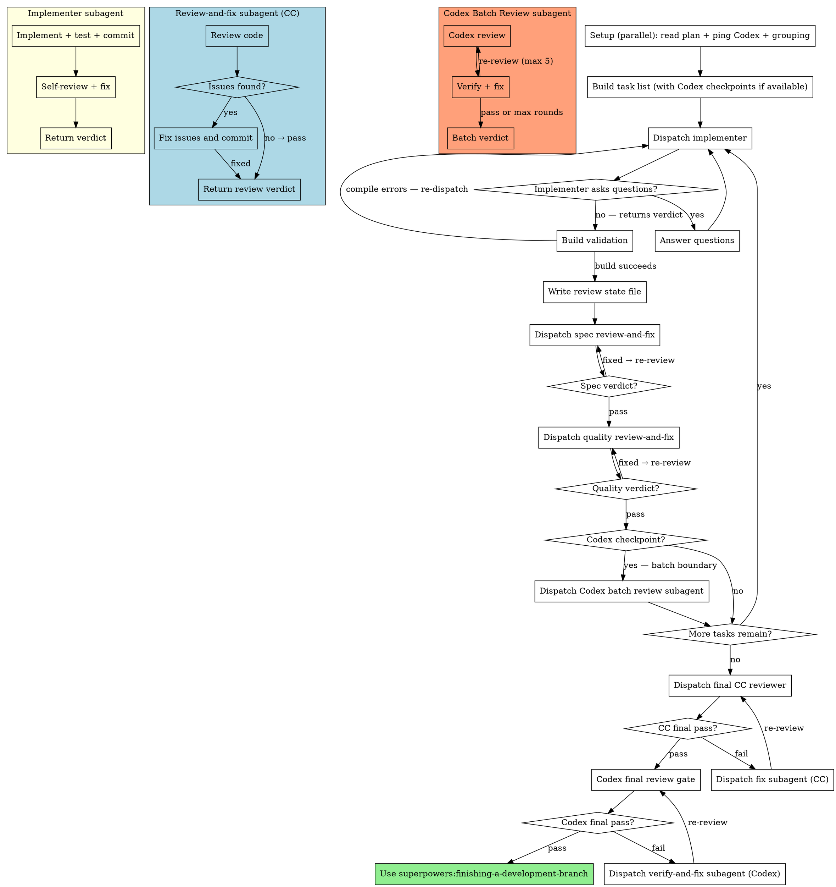

# Subagent-Driven Development

Execute plan by dispatching fresh subagents per task. Implementer handles: implement → self-review. Main session dispatches spec compliance and code quality reviewer subagents per task, plus Codex batch reviews at strategic checkpoints between task groups.

**Why subagents:** You delegate tasks to specialized agents with isolated context. By precisely crafting their instructions and context, you ensure they stay focused and succeed at their task. They should never inherit your session's context or history — you construct exactly what they need. This also preserves your own context for coordination work.

**Core principle:** Fresh subagent per task. Implementer builds and self-reviews. Main session orchestrates independent CC reviewer subagents for spec compliance and code quality, plus Codex batch reviews after groups of related tasks.

## When to Use



**vs. Executing Plans (parallel session):**
- Same session (no context switch)
- Fresh subagent per task (no context pollution)
- Three-stage per-task review: self-review → spec compliance (CC) → code quality (CC)
- Codex batch reviews at strategic checkpoints between task groups
- Final gates: CC final review → Codex final review
- Faster iteration (no human-in-loop between tasks)

## Setup

Before dispatching the first task:

1. **Verify worktree** — never implement on main/master. Check if you're in a worktree:
   ```bash
   git rev-parse --git-common-dir 2>/dev/null
   ```
   If the result equals `.git` (not a worktree), invoke `superpowers:using-git-worktrees` to create one before continuing. If already in a worktree, proceed.

2. **Parallel setup** — dispatch all three in the same turn (single message, three tool calls):

   a. **Read plan file** — discover and read the plan:
      - Check breadcrumb first:
        ```bash
        MAIN_REPO="$(cd "$(git rev-parse --git-common-dir)/.." && pwd)"
        PLAN_PATH="$MAIN_REPO/$(cat "$MAIN_REPO/.dev-state/current_plan" 2>/dev/null)"
        ```
      - If breadcrumb missing or file not found: scan `docs/superpowers/plans/` for the most recent plan file (by filename date prefix or modification time)
      - If multiple candidates: ask the user which one
      - Extract all tasks with full text and context

   b. **Ping Codex availability** — call `codex` MCP with a simple ping (always pass `sandbox: "read-only"`). If it responds, set `CODEX_AVAILABLE: true`. If it errors, set `CODEX_AVAILABLE: false`.

   c. **Dispatch grouping subagent (sonnet)** — determines where to insert review checkpoints (Codex or CC fallback):
      ```
      Agent tool:
        model: sonnet
        description: "Group tasks for Codex review checkpoints"
        prompt: |
          Read the plan file at: {PLAN_FILE_PATH}

          Analyze the tasks and group them by feature or topic. Determine where
          Codex review checkpoints should be inserted — after groups of related
          implementation tasks finish.

          Guidelines:
          - Group tasks that work on the same feature, module, or topic
          - Place a checkpoint after each group completes
          - Don't put a checkpoint after every single task — batch related work
          - Don't create groups larger than ~4 tasks (reviews lose focus)
          - The final task does NOT need a checkpoint (there's a separate final review)
          - If all tasks are closely related (same feature), place a single checkpoint
            after the second-to-last task
          - If there are only 1-2 tasks total, return an empty array (final review
            is sufficient)

          Return ONLY a JSON array of checkpoint positions:
          ```json
          [
            {"after_task": 2, "covers_tasks": [1, 2], "topic": "authentication"},
            {"after_task": 5, "covers_tasks": [3, 4, 5], "topic": "API endpoints"}
          ]
          ```
      ```

   **Fallback:** If the grouping subagent fails or returns invalid JSON, fall back to no batch checkpoints.

3. **Build task list** — after all three parallel operations complete:
   - If grouping succeeded: interleave batch review items at positions from the grouping subagent. Label as "Codex batch review" if `CODEX_AVAILABLE: true`, or "CC batch review" if `CODEX_AVAILABLE: false`.
   - If grouping failed: build task list without batch reviews
   - Create TodoWrite with all tasks (implementation tasks + batch checkpoint items)

   Example task list with checkpoints:
   ```
   1. [ ] Task 1: Add auth middleware
   2. [ ] Task 2: Add session management
   3. [ ] Codex batch review: Tasks 1-2 (authentication)
   4. [ ] Task 3: Add API routes
   5. [ ] Task 4: Add request validation
   6. [ ] Task 5: Add rate limiting
   7. [ ] Codex batch review: Tasks 3-5 (API endpoints)
   ```

4. **Initialize batch tracking:**
   ```bash
   MAIN_REPO="$(cd "$(git rev-parse --git-common-dir)/.." && pwd)"
   echo "$(git rev-parse HEAD)" > "$MAIN_REPO/.dev-state/last_codex_batch_sha"
   ```

5. **Record BASE_SHA** — the commit before the first task: `git rev-parse HEAD`

## The Process



**Yellow box** = implementer subagent (implement + self-review).
**Blue box** = review-and-fix subagent — reviews code, fixes any issues it finds, returns verdict. Main session dispatches fresh ones until one returns `pass` (no issues found).
**Salmon box** = Codex batch review subagent — sends batch to Codex, verifies findings against actual code, fixes verified issues, loops up to 5 rounds. Runs as a single self-contained agent.

**When Codex is unavailable:** All Codex nodes in the diagram are replaced by CC fallback equivalents. Codex batch reviews become CC batch reviews. Codex final review becomes CC second-opinion final review (max 3 rounds). See the CC Fallback sections below for dispatch prompts.

## Model Selection

**Always use Opus for implementer subagents.** Implementers handle implementation and self-review which requires judgment and multi-phase reasoning. Do not downgrade to cheaper models.

## Review State File

Write review state to disk after each step so compaction can't lose progress. The main session reads this file before every dispatch to recover its position.

**Path:** `$STATE_DIR/task-{N}-review.md` (where `STATE_DIR` is `.dev-state/` at main repo root)

**Format:**
```markdown
task: {N}
task_name: {TASK_NAME}
stage: implementer | spec-compliance | code-quality | complete
round: {N}
max_rounds: 3
status: pending | fixed | pass
base_sha: {BASE_SHA}
head_sha: {current HEAD}
working_directory: {WORKING_DIRECTORY}
task_text: |
  {TASK_TEXT — full task from plan}
implementation_summary: |
  {from implementer verdict}
files_changed: |
  {from implementer verdict}
last_findings: |
  {findings from most recent review, if any}
```

**When to write/update:**
1. After build validation succeeds (Step 1b) → create file with `stage: spec-compliance, round: 1, status: pending`
2. After each review-and-fix subagent returns → update `round`, `status`, `head_sha`, `last_findings`
3. **CRITICAL — After stage passes → update BOTH `stage` AND `round: 1` in a single edit.** The round counter is per-stage, not cumulative. Failing to reset round causes the next stage to inherit the previous stage's round count, leading to premature escalation.
4. After all reviews pass → set `stage: complete`

**On compaction recovery:** Read the state file to know exactly where you are. Re-read the plan file if task text is needed. The state file has everything needed to dispatch the next subagent.

## Per-Task Flow (Main Session)

<HARD-GATE>
**NEVER skip Steps 2–3 (spec compliance + code quality reviews).** Every task MUST go through all steps before the next task is dispatched. The implementer's self-review is NOT a substitute for the CC reviewer subagents. If you catch yourself about to dispatch the next task without completing reviews, STOP — you are violating the process.
</HARD-GATE>

For each task:

**Commit discipline:** The main session NEVER commits implementation code. All commits come from subagents (implementer, review-and-fix). The main session only writes/updates review state files and `.dev-state/` breadcrumbs. Before any commit attempt in the main session, verify uncommitted changes exist with `git status --short` — if clean, skip the commit.

### Step 1: Dispatch Implementer

```
Agent tool:
  description: "Implement Task {N}: {TASK_NAME}"
  model: opus
  prompt: |
    [Use ./implementer-prompt.md template]
```

Handle the implementer verdict (see Handling Implementer Verdicts below). If `pass`, proceed to Step 1b.

### Step 1b: Build Validation

After the implementer returns `pass`, independently verify the build from the main session **before writing the review state file**:

```bash
cd {WORKING_DIRECTORY}
# Use the project's build command (dotnet build, npm run build, cargo build, etc.)
```

- **Build succeeds:** Write the review state file and proceed to Step 2. Ignore any stale LSP/IDE annotations — the build is ground truth.
- **Build fails with compile errors:** Re-dispatch the implementer with the build error output as additional context. Do not write the review state file.
- **Build fails for environment/tooling reasons** (missing SDK, network issues, etc.): Diagnose and fix the environment issue in the main session. Do not re-dispatch the implementer — their code is not at fault.

### Step 2: Spec Compliance Review-and-Fix Loop

Read the state file. Dispatch a review-and-fix subagent:

```
Agent tool:
  subagent_type: "superpowers:code-reviewer"
  description: "Spec review-and-fix for Task {N} (round {R})"
  prompt: |
    You are a SPEC COMPLIANCE review-and-fix agent.

    ## Your Job

    1. Review the implementation against the spec
    2. If issues found: FIX them, run tests, commit fixes
    3. Return your verdict

    ## What Was Requested

    {TASK_TEXT}

    ## What Implementer Claims They Built

    {IMPLEMENTATION_SUMMARY from implementer verdict}

    ## Files Changed

    {FILES_CHANGED from implementer verdict}

    ## CRITICAL: Do Not Trust the Report

    The implementer's report may be incomplete or optimistic. Verify independently.

    **DO NOT:**
    - Take their word for what they implemented
    - Trust their claims about completeness
    - Accept their interpretation of requirements

    **DO:** Read the actual code, compare to requirements line by line.

    ```bash
    cd {WORKING_DIRECTORY}
    git diff {BASE_SHA}..HEAD
    ```

    **Check for:**
    - Missing requirements: Did they implement everything requested?
    - Extra/unneeded work: Did they build things not in spec?
    - Misunderstandings: Did they solve the wrong problem?

    ## If Issues Found

    Fix them directly. Run tests. Commit with conventional format:
    `fix(scope): address spec compliance issues`

    ## Verdict

    Return exactly one of:
    - verdict: pass — No issues found. Implementation matches spec.
    - verdict: fixed — Issues found and fixed. List what was found and what was changed.

    Include: findings (if any), fixes applied (if any), files changed, test results.
```

**After subagent returns:**
- Update state file with verdict, round, head_sha, last_findings
- If `pass`: update state file — change `stage: code-quality` AND `round: 1` in a single edit (round resets per stage). Proceed to Step 3.
- If `fixed`: increment round. If round <= max_rounds, dispatch fresh review-and-fix subagent (re-review the fixes). If round > max_rounds, escalate to human.

### Step 3: Code Quality Review-and-Fix Loop

**Only after spec compliance passes.**

Read the state file. Dispatch a review-and-fix subagent:

```
Agent tool:
  subagent_type: "superpowers:code-reviewer"
  description: "Quality review-and-fix for Task {N} (round {R})"
  prompt: |
    You are a CODE QUALITY review-and-fix agent.

    Review code changes for Task {N}: {TASK_NAME}

    WHAT_WAS_IMPLEMENTED: {IMPLEMENTATION_SUMMARY}
    PLAN_OR_REQUIREMENTS: {TASK_TEXT}
    BASE_SHA: {BASE_SHA}
    HEAD_SHA: HEAD
    DESCRIPTION: {task summary}

    Working directory: {WORKING_DIRECTORY}

    ```bash
    cd {WORKING_DIRECTORY}
    git diff {BASE_SHA}..HEAD
    ```

    ## If Critical or Important Issues Found

    Fix them directly. Run tests. Commit with conventional format:
    `fix(scope): address code quality issues`

    ## Verdict

    Return exactly one of:
    - verdict: pass — No Critical or Important issues found.
    - verdict: fixed — Issues found and fixed. List what was found and what was changed.

    Include: findings (if any), fixes applied (if any), files changed, test results.
```

**After subagent returns:**
- Update state file with verdict, round, head_sha, last_findings
- If `pass`: set `stage: complete`. Mark task complete in TodoWrite.
  - **If this task is at a Codex batch checkpoint:** proceed to Codex Batch Review (next section).
  - **Otherwise:** proceed to next task.
- If `fixed`: increment round. If round <= max_rounds, dispatch fresh review-and-fix subagent. If round > max_rounds, escalate to human.

### Summary: Main Session Actions Per Review Dispatch

Each review dispatch costs ~700 tokens in main session context:
1. Read state file (~50 tokens)
2. Dispatch subagent with prompt (~300 tokens)
3. Receive verdict (~200 tokens)
4. Update state file (~50 tokens)
5. Decision: next step or re-dispatch (~100 tokens)

## Codex Batch Review Checkpoints

When the task list includes a Codex batch review checkpoint after the current task, dispatch a batch review subagent. These checkpoints were determined during setup by the grouping subagent and are visible as items in the TodoWrite task list.

**If Codex becomes unavailable** at the time a Codex checkpoint runs (was available during setup but errors now): run the checkpoint as a CC batch review instead. Use the CC Batch Review dispatch below.

### Dispatch Codex Batch Review

Read the batch commit range:
```bash
MAIN_REPO="$(cd "$(git rev-parse --git-common-dir)/.." && pwd)"
BATCH_START_SHA=$(cat "$MAIN_REPO/.dev-state/last_codex_batch_sha")
BATCH_END_SHA=$(git rev-parse HEAD)
```

```
Agent tool:
  model: opus
  description: "Codex batch review: Tasks {BATCH_TASKS}"
  prompt: |
    [Use ./codex-batch-reviewer-prompt.md template]

    BATCH_TASKS: {list of task numbers and names in this batch}
    BATCH_START_SHA: {BATCH_START_SHA}
    BATCH_END_SHA: {BATCH_END_SHA}
    BATCH_SUMMARY: {short summary of what the batch implemented}
    WORKING_DIRECTORY: {WORKING_DIRECTORY}
    TEST_STATUS: {current test pass/fail count}
```

### After Batch Review Returns

- **pass / all-false-positives:** Update batch tracking SHA, mark checkpoint complete in TodoWrite, proceed to next task.
- **fixed:** Update batch tracking SHA, mark checkpoint complete in TodoWrite, proceed to next task.
- **blocked:** Escalate to human with the unresolved findings.

Update batch tracking after every completed batch review:
```bash
MAIN_REPO="$(cd "$(git rev-parse --git-common-dir)/.." && pwd)"
echo "$(git rev-parse HEAD)" > "$MAIN_REPO/.dev-state/last_codex_batch_sha"
```

### Dispatch CC Batch Review

When Codex is unavailable (either from setup or at runtime), dispatch a CC batch reviewer instead:

```
Agent tool:
  subagent_type: "superpowers:code-reviewer"
  description: "CC batch review: Tasks {BATCH_TASKS} (round {R})"
  prompt: |
    You are a BATCH REVIEWER reviewing a group of related tasks together.

    ## What to Review

    Review ALL changes in this batch:

    ```bash
    cd {WORKING_DIRECTORY}
    git diff {BATCH_START_SHA}..{BATCH_END_SHA}
    ```

    Tasks in this batch: {BATCH_TASKS}
    Batch summary: {BATCH_SUMMARY}

    ## Review Focus

    - **Integration:** Do the tasks in this batch work together correctly?
    - **Consistency:** Are patterns and conventions consistent across tasks?
    - **Missing pieces:** Anything implied by the tasks that wasn't implemented?
    - **Cross-task issues:** Problems only visible when viewing tasks together

    ## If Critical or Important Issues Found

    Fix them directly. Run tests. Commit with:
    `fix(scope): address CC batch review findings`

    ## Verdict

    Return exactly one of:
    - verdict: pass — No Critical or Important issues found.
    - verdict: fixed — Issues found and fixed. List what was found and what was changed.
```

**After CC batch review returns:**
- `pass`: Update batch tracking SHA, mark checkpoint complete, proceed to next task.
- `fixed`: Dispatch a fresh CC batch reviewer to verify fixes. Max 3 rounds — escalate to human if still finding issues. Then update batch tracking SHA and proceed.

## Handling Implementer Verdicts

Implementer subagents return a structured verdict after self-review. Handle each:

**`pass`:** Self-review clean. Proceed to build validation (Step 1b).

**`fail`:** Self-review found unresolved issues. Read the unresolved items. Assess:
- If fixable with more context: re-dispatch with additional context
- If the plan itself is wrong: escalate to the human

**`needs_context`:** The implementer needs information before starting. Provide the missing context and re-dispatch.

**`blocked`:** The implementer cannot complete the task. Assess the blocker:
1. If it's a context problem, provide more context and re-dispatch
2. If the task is too large, break it into smaller pieces
3. If the plan itself is wrong, escalate to the human

**Never** ignore an escalation or force the same model to retry without changes.

## Prompt Templates

- `./implementer-prompt.md` - Dispatch implementer subagent (implement + self-review)
- `./spec-reviewer-prompt.md` - Spec compliance reviewer reference (dispatched by main session)
- `./code-quality-reviewer-prompt.md` - Code quality reviewer reference (dispatched by main session)
- `./codex-batch-reviewer-prompt.md` - Codex batch review subagent (review + verify + fix loop)

## Example Workflow

```
You: I'm using Subagent-Driven Development to execute this plan.

[Parallel setup — all three at once:]
  [Read plan file: docs/superpowers/plans/feature-plan.md — 7 tasks extracted]
  [Ping Codex → CODEX_AVAILABLE: true]
  [Grouping subagent (sonnet) → checkpoints: after task 3 (auth), after task 6 (API)]

[Build task list:]
  1. Task 1: Add auth middleware
  2. Task 2: Add session tokens
  3. Task 3: Add auth tests
  4. Codex batch review: Tasks 1-3 (authentication)
  5. Task 4: Add API routes
  6. Task 5: Add request validation
  7. Task 6: Add rate limiting
  8. Codex batch review: Tasks 4-6 (API layer)
  9. Task 7: Add integration tests

[Initialize batch tracking: last_codex_batch_sha = BASE_SHA]
[Record BASE_SHA]

Task 1: Add auth middleware

[Dispatch implementer (Opus) with full task text + context]

Implementer returns verdict:
  task: 1
  verdict: pass
  implementation_summary: Added auth middleware with JWT validation
  files_changed: src/auth/middleware.ts, tests/auth/middleware.test.ts
  tests: 4/4 passing

[Build validation: run project build command → build succeeds]
[Write state file: stage=spec-compliance, round=1]
[Dispatch spec review-and-fix → verdict: pass]
[Update state: stage=code-quality, round=1]
[Dispatch quality review-and-fix → verdict: pass]
[Update state: stage=complete]
[Mark Task 1 complete]
[Not a Codex checkpoint → proceed to Task 2]

Task 2: Add session tokens
... (same per-task flow)

Task 3: Add auth tests
... (same per-task flow)
[Mark Task 3 complete]
[This IS a Codex checkpoint]

Codex batch review: Tasks 1-3 (authentication)

[Read batch range: last_codex_batch_sha..HEAD]
[Dispatch Codex batch review subagent (Opus)]

Batch review subagent:
  [Creates Codex thread, sends review for batch commits]
  [Codex reports 2 findings]
  [Verifies: 1 real issue, 1 false positive]
  [Fixes verified issue, commits, re-reviews]
  [Codex clean on round 2]
  Returns: verdict=fixed, rounds=2, findings_fixed=1, findings_dismissed=1

[Update last_codex_batch_sha to HEAD]
[Mark Codex checkpoint complete]

Task 4: Add API routes
... (per-task flow continues)

... (Tasks 5-6, then second Codex batch review)
... (Task 7, no checkpoint needed — final review covers it)

[After all tasks complete]

CC final review (round 1):
[Dispatch CC final reviewer → pass: all requirements met, code quality good]

Codex final review (round 1):
[Dispatch Codex final review (BASE_SHA..HEAD — full implementation)]
[pass: no cross-cutting issues found]

[Use superpowers:finishing-a-development-branch]
```

## Final Reviews (After All Tasks Complete)

After all per-task reviews and batch checkpoints pass, run two final reviews across the entire implementation. CC final reviewer runs first (catches cross-cutting issues with full tool access), then Codex runs last (independent second opinion reviewing the FULL implementation from BASE_SHA..HEAD). Both use a fix-subagent + retry loop — the main session never fixes code itself.

**The Codex final review covers the full implementation (BASE_SHA..HEAD)**, not just the last batch. This is intentional — it catches cross-cutting issues across all tasks that batch reviews (which are incremental) would miss.

### Step 1: CC Final Code Review

Dispatch a final CC reviewer subagent to review the entire implementation:

```
Agent tool:
  subagent_type: "superpowers:code-reviewer"
  description: "CC final review (round {R})"
  prompt: |
    You are the FINAL CODE REVIEWER for a complete implementation.

    ## What to Review

    Review ALL changes from the full implementation:

    ```bash
    cd {WORKING_DIRECTORY}
    git diff {BASE_SHA}..HEAD
    ```

    Plan: {PLAN_FILE_PATH}
    Summary: {WHAT_THE_FULL_PLAN_IMPLEMENTED}

    ## Review Focus

    - Cross-cutting concerns: consistency across all tasks
    - Integration issues: do the pieces work together?
    - Missing pieces: anything the plan required that wasn't implemented?
    - Architecture: does the overall structure make sense?
    - Test coverage: are there gaps across the full implementation?

    ## If Critical or Important Issues Found

    Fix them directly. Run tests. Commit with conventional format:
    `fix(scope): address final review findings`

    ## Verdict

    Return exactly one of:
    - verdict: pass — No Critical or Important issues found. Implementation is ready.
    - verdict: fixed — Issues found and fixed. List what was found and what was changed.

    Include: findings (if any), fixes applied (if any), files changed, test results.
```

**After subagent returns:**
- If `pass`: proceed to Step 2 (Codex Final Review).
- If `fixed`: dispatch a fresh CC final reviewer to verify the fixes (the fixer should not review their own work). Max 5 rounds — escalate to human if still finding issues.

### Step 2: Codex Final Review (or CC Fallback)

**Only after CC final review passes.** This is the last gate — an independent second opinion covering the FULL implementation.

**If Codex is available:** See `lib/codex-integration.md` for full protocol. Batch reviews during execution covered incremental slices. This final review catches cross-cutting issues across the entire implementation (BASE_SHA..HEAD).

1. Get commit SHAs covering all implementation (from first task to HEAD)
2. Dispatch codex-agent (foreground):
   ```
   Agent tool:
     subagent_type: "superpowers:codex-agent"
     description: "Codex final review"
     prompt: |
       mode: review-gate
       thread_id: "new"
       message: |
         Final review of complete implementation.
         Commits: <BASE_SHA>..<HEAD_SHA>
         Summary: <what the full plan implemented>
         Tests: <all tests pass/fail summary>
       context: Full implementation of <plan-file-path>
       worktree_path: <worktree-path>
       profile: xhigheffort
   ```
3. Echo `**Active Codex thread_id:** <id>`
4. If `pass`: proceed to `superpowers:finishing-a-development-branch`
5. If `unavailable`: skip to CC Fallback Final Review below
6. If `fail`: dispatch a verify-and-fix subagent. Codex can produce false positives, so the subagent must independently verify each finding against the actual code before fixing anything:
   ```
   Agent tool:
     subagent_type: "superpowers:code-reviewer"
     description: "Verify-and-fix Codex final findings (round {R})"
     prompt: |
       You are a VERIFY-AND-FIX agent for Codex review findings.

       Codex is a useful reviewer but it can produce false positives.
       You MUST independently verify each finding before acting on it.

       Working directory: {WORKING_DIRECTORY}

       ## Codex Findings

       {CODEX_FINDINGS — paste the full findings from Codex response}

       ## Verification Protocol

       For EACH finding:
       1. Read the actual code at the cited file and line
       2. Determine if the issue genuinely exists in the code
       3. Classify as: VERIFIED (real issue) or FALSE POSITIVE (Codex was wrong)

       ## After Verification

       - Dismiss all false positives — explain briefly why each is wrong
       - Fix all verified issues
       - Run tests — all must pass
       - Commit with: `fix(scope): address verified Codex final review findings`

       ## Verdict

       Return exactly one of:
       - verdict: fixed — Verified issues found and fixed. List verified vs dismissed.
       - verdict: all-false-positives — Every finding was a false positive. List evidence.
       - verdict: blocked — Cannot fix a verified issue. Explain why.

       Include: verification results for each finding, fixes applied, files changed, test results.
   ```
   After the subagent returns:
   - `fixed`: re-dispatch the Codex final review to verify. Max 5 rounds.
   - `all-false-positives`: treat as pass — proceed to `superpowers:finishing-a-development-branch`.
   - `blocked`: escalate to human.
6. Track any unresolved flags in `docs/unresolved-flags.md`

### CC Fallback Final Review (when Codex unavailable)

When Codex is unavailable, dispatch a CC second-opinion final reviewer instead. This provides a different perspective from the CC final review in Step 1 — it focuses on requirements completeness and edge cases rather than code quality and architecture.

```
Agent tool:
  subagent_type: "superpowers:code-reviewer"
  description: "CC second-opinion final review (round {R})"
  prompt: |
    You are an INDEPENDENT SECOND-OPINION REVIEWER for a complete implementation.
    A separate CC reviewer has already passed this code for quality and cross-cutting concerns.
    Your role is to provide a genuinely different perspective.

    ## What to Review

    Review ALL changes from the full implementation:

    ```bash
    cd {WORKING_DIRECTORY}
    git diff {BASE_SHA}..HEAD
    ```

    Plan: {PLAN_FILE_PATH}
    Summary: {WHAT_THE_FULL_PLAN_IMPLEMENTED}

    ## Review Focus (different from prior review)

    - **Requirements completeness:** Does the implementation satisfy ALL plan requirements?
    - **Edge cases and error handling:** What happens when things go wrong?
    - **Security:** Any potential vulnerabilities introduced?
    - **Dependency risks:** Are new dependencies appropriate and up-to-date?
    - **Testability gaps:** Are there important paths that aren't tested?

    Do NOT re-review code style, naming, or architecture — that was already reviewed.

    ## If Critical or Important Issues Found

    Fix them directly. Run tests. Commit with:
    `fix(scope): address CC second-opinion review findings`

    ## Verdict

    Return exactly one of:
    - verdict: pass — No Critical or Important issues found. Implementation is ready.
    - verdict: fixed — Issues found and fixed. List what was found and what was changed.
```

**After CC second-opinion returns:**
- `pass`: proceed to `superpowers:finishing-a-development-branch`
- `fixed`: dispatch a fresh CC second-opinion reviewer to verify fixes. Max 3 rounds — escalate to human if still finding issues.

## Advantages

**vs. Manual execution:**
- Subagents follow TDD naturally
- Fresh context per task (no confusion)
- Subagent can ask questions (before AND during work)

**vs. Executing Plans:**
- Same session (no handoff)
- Continuous progress (no waiting)
- Automated review pipeline

**Quality gates (per task):**
- Self-review catches issues first (inside implementer)
- Build validation catches compile errors before review (main session runs project build)
- Spec compliance review-and-fix prevents over/under-building (independent CC subagent, fixes inline)
- Code quality review-and-fix ensures implementation is well-built (independent CC subagent, fixes inline)

**Batch review (at checkpoints):**
- Reviews groups of related tasks together (more efficient than per-task)
- Catches issues across related tasks within a topic
- Uses Codex when available, CC batch reviewer as fallback
- Checkpoints are planned upfront and visible in the task list

**Final gates (after all tasks):**
- CC final review catches cross-cutting issues (review-and-fix subagent + retry loop)
- Second gate: Codex final review when available, CC second-opinion review as fallback — independent perspective covering full implementation
- Fresh re-review after each fix ensures fixes don't introduce new problems

## Red Flags

**Never:**
- Start implementation on main/master branch without explicit user consent
- Dispatch multiple implementation subagents in parallel (conflicts)
- Make subagent read plan file (provide full text instead)
- Skip scene-setting context (subagent needs to understand where task fits)
- Ignore subagent questions (answer before letting them proceed)
- Mark a task complete if any review stage is `fail` — address unresolved issues first
- Fix code in the main session — always dispatch a fix subagent instead (context pollution)
- Skip spec compliance or code quality reviews — they catch what self-review misses
- Skip Codex final review — it catches cross-cutting issues that batch reviews miss
- Proceed to finishing-a-development-branch before both final reviews pass
- Skip batch review checkpoints entirely — when Codex is unavailable, use CC batch reviews instead
- Commit code that a subagent already committed (always check `git status` first)
- Use SendMessage to continue a subagent that has already returned a verdict — it wastes tokens reconstructing stale context. For follow-up work, dispatch a fresh agent. The only valid SendMessage is answering an implementer's pre-verdict questions.

**If subagent asks questions:**
- Answer clearly and completely
- Provide additional context if needed
- Re-dispatch with the answer

**If review-and-fix returns `fixed`:**
- The subagent already fixed the issues — no need to re-dispatch the implementer
- Dispatch a fresh review-and-fix subagent to independently verify the fixes
- Max 3 rounds per review stage — escalate to human if still finding issues

**If Codex batch review returns `blocked`:**
- Escalate to human — do not skip and proceed silently
- The blocked findings need human judgment

**After compaction:**
- Read the state file at `.dev-state/task-{N}-review.md` to recover position
- Re-read the plan file if task text is needed
- Check `.dev-state/last_codex_batch_sha` for batch review tracking
- Check TodoWrite for which checkpoints have been completed
- Continue from where the state file says you left off

## Integration

**Required workflow skills:**
- **superpowers:using-git-worktrees** - REQUIRED: Set up isolated workspace before starting
- **superpowers:writing-plans** - Creates the plan this skill executes
- **superpowers:requesting-code-review** - Code review template for reviewer subagents
- **superpowers:finishing-a-development-branch** - Complete development after all tasks

**Subagents should use:**
- **superpowers:test-driven-development** - Subagents follow TDD for each task

**Alternative workflow:**
- **superpowers:executing-plans** - Use for parallel session instead of same-session execution
