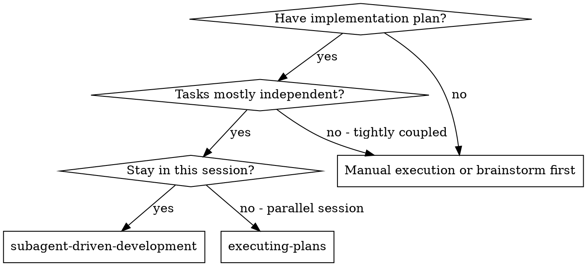
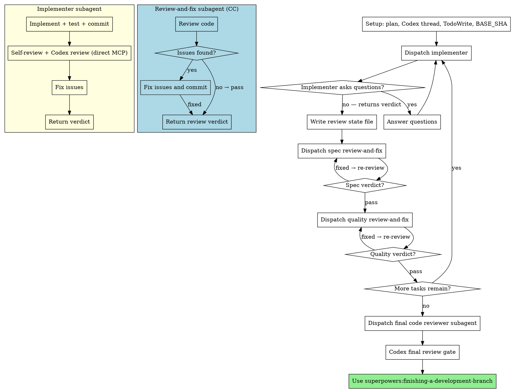

# Subagent-Driven Development

Execute plan by dispatching fresh subagents per task. Implementer handles: implement → self-review → Codex review. Main session then dispatches spec compliance and code quality reviewer subagents before proceeding to the next task.

**Core principle:** Fresh subagent per task. Implementer builds and self-reviews. Main session orchestrates independent CC reviewer subagents for spec compliance and code quality.

## When to Use



**vs. Executing Plans (parallel session):**
- Same session (no context switch)
- Fresh subagent per task (no context pollution)
- Four-stage review: self-review → Codex → spec compliance (CC) → code quality (CC)
- Faster iteration (no human-in-loop between tasks)

## Setup

Before dispatching the first task:

1. **Verify worktree** — never implement on main/master. Check if you're in a worktree:
   ```bash
   git rev-parse --git-common-dir 2>/dev/null
   ```
   If the result equals `.git` (not a worktree), invoke `superpowers:using-git-worktrees` to create one before continuing. If already in a worktree, proceed.

2. **Find and read plan file** — the user may have cleared the session, so discover the plan:
   - **Check breadcrumb first:**
     ```bash
     MAIN_REPO="$(cd "$(git rev-parse --git-common-dir)/.." && pwd)"
     PLAN_PATH="$MAIN_REPO/$(cat "$MAIN_REPO/.dev-state/current_plan" 2>/dev/null)"
     ```
   - **If breadcrumb missing or file not found:** scan `docs/superpowers/plans/` for the most recent plan file (by filename date prefix or modification time)
   - **If multiple candidates:** ask the user which one
   - Read the plan file and extract all tasks with full text and context
3. **Create TodoWrite** with all tasks
4. **Create a Codex thread (foreground)** for per-task reviews (shared across tasks):
   ```
   Agent tool:
     subagent_type: "superpowers:codex-agent"
     description: "Init Codex thread for implementation"
     prompt: |
       mode: init
       profile: higheffort
   ```
   Save the returned `thread_id`. Pass it to all implementer subagents as `CODEX_THREAD_ID`.
   If codex-agent reports `status: unavailable`, set `CODEX_STATUS: unavailable` and `CODEX_THREAD_ID: none`.
5. **Record BASE_SHA** — the commit before the first task: `git rev-parse HEAD`

## The Process



**Yellow box** = implementer subagent (implement + self-review + Codex).
**Blue box** = review-and-fix subagent — reviews code, fixes any issues it finds, returns verdict. Main session dispatches fresh ones until one returns `pass` (no issues found).

## Model Selection

**Always use Opus for implementer subagents.** Implementers handle implementation, self-review, and Codex interaction which requires judgment and multi-phase reasoning. Do not downgrade to cheaper models.

## Review State File

Write review state to disk after each step so compaction can't lose progress. The main session reads this file before every dispatch to recover its position.

**Path:** `$STATE_DIR/task-{N}-review.md` (where `STATE_DIR` is `.dev-state/` at main repo root)

**Format:**
```markdown
task: {N}
task_name: {TASK_NAME}
stage: implementer | spec-compliance | code-quality | complete
round: {N}
max_rounds: 3
status: pending | fixed | pass
base_sha: {BASE_SHA}
head_sha: {current HEAD}
working_directory: {WORKING_DIRECTORY}
task_text: |
  {TASK_TEXT — full task from plan}
implementation_summary: |
  {from implementer verdict}
files_changed: |
  {from implementer verdict}
last_findings: |
  {findings from most recent review, if any}
```

**When to write/update:**
1. After implementer returns → create file with `stage: spec-compliance, round: 1, status: pending`
2. After each review-and-fix subagent returns → update `round`, `status`, `head_sha`, `last_findings`
3. **CRITICAL — After stage passes → update BOTH `stage` AND `round: 1` in a single edit.** The round counter is per-stage, not cumulative. Failing to reset round causes the next stage to inherit the previous stage's round count, leading to premature escalation.
4. After all reviews pass → set `stage: complete`

**On compaction recovery:** Read the state file to know exactly where you are. Re-read the plan file if task text is needed. The state file has everything needed to dispatch the next subagent.

## Per-Task Flow (Main Session)

<HARD-GATE>
**NEVER skip Steps 2–3 (spec compliance + code quality reviews).** Every task MUST go through all three steps before the next task is dispatched. The implementer's self-review and Codex review are NOT substitutes for the CC reviewer subagents. If you catch yourself about to dispatch the next task without completing reviews, STOP — you are violating the process.
</HARD-GATE>

For each task:

### Step 1: Dispatch Implementer

```
Agent tool:
  description: "Implement Task {N}: {TASK_NAME}"
  model: opus
  prompt: |
    [Use ./implementer-prompt.md template]
```

Handle the implementer verdict (see Handling Implementer Verdicts below). If `pass`, write the review state file and proceed to Step 2.

### Step 2: Spec Compliance Review-and-Fix Loop

Read the state file. Dispatch a review-and-fix subagent:

```
Agent tool:
  subagent_type: "feature-dev:code-reviewer"
  description: "Spec review-and-fix for Task {N} (round {R})"
  prompt: |
    You are a SPEC COMPLIANCE review-and-fix agent.

    ## Your Job

    1. Review the implementation against the spec
    2. If issues found: FIX them, run tests, commit fixes
    3. Return your verdict

    ## What Was Requested

    {TASK_TEXT}

    ## What Implementer Claims They Built

    {IMPLEMENTATION_SUMMARY from implementer verdict}

    ## Files Changed

    {FILES_CHANGED from implementer verdict}

    ## CRITICAL: Do Not Trust the Report

    The implementer's report may be incomplete or optimistic. Verify independently.

    **DO:** Read the actual code, compare to requirements line by line.

    ```bash
    cd {WORKING_DIRECTORY}
    git diff {BASE_SHA}..HEAD
    ```

    **Check for:**
    - Missing requirements: Did they implement everything requested?
    - Extra/unneeded work: Did they build things not in spec?
    - Misunderstandings: Did they solve the wrong problem?

    ## If Issues Found

    Fix them directly. Run tests. Commit with conventional format:
    `fix(scope): address spec compliance issues`

    ## Verdict

    Return exactly one of:
    - verdict: pass — No issues found. Implementation matches spec.
    - verdict: fixed — Issues found and fixed. List what was found and what was changed.

    Include: findings (if any), fixes applied (if any), files changed, test results.
```

**After subagent returns:**
- Update state file with verdict, round, head_sha, last_findings
- If `pass`: update state file — change `stage: code-quality` AND `round: 1` in a single edit (round resets per stage). Proceed to Step 3.
- If `fixed`: increment round. If round <= max_rounds, dispatch fresh review-and-fix subagent (re-review the fixes). If round > max_rounds, escalate to human.

### Step 3: Code Quality Review-and-Fix Loop

**Only after spec compliance passes.**

Read the state file. Dispatch a review-and-fix subagent:

```
Agent tool:
  subagent_type: "feature-dev:code-reviewer"
  description: "Quality review-and-fix for Task {N} (round {R})"
  prompt: |
    You are a CODE QUALITY review-and-fix agent.

    Review code changes for Task {N}: {TASK_NAME}

    WHAT_WAS_IMPLEMENTED: {IMPLEMENTATION_SUMMARY}
    PLAN_OR_REQUIREMENTS: {TASK_TEXT}
    BASE_SHA: {BASE_SHA}
    HEAD_SHA: HEAD
    DESCRIPTION: {task summary}

    Working directory: {WORKING_DIRECTORY}

    ## If Critical or Important Issues Found

    Fix them directly. Run tests. Commit with conventional format:
    `fix(scope): address code quality issues`

    ## Verdict

    Return exactly one of:
    - verdict: pass — No Critical or Important issues found.
    - verdict: fixed — Issues found and fixed. List what was found and what was changed.

    Include: findings (if any), fixes applied (if any), files changed, test results.
```

**After subagent returns:**
- Update state file with verdict, round, head_sha, last_findings
- If `pass`: set `stage: complete`. Mark task complete in TodoWrite. Proceed to next task.
- If `fixed`: increment round. If round <= max_rounds, dispatch fresh review-and-fix subagent. If round > max_rounds, escalate to human.

### Summary: Main Session Actions Per Review Dispatch

Each review dispatch costs ~700 tokens in main session context:
1. Read state file (~50 tokens)
2. Dispatch subagent with prompt (~300 tokens)
3. Receive verdict (~200 tokens)
4. Update state file (~50 tokens)
5. Decision: next step or re-dispatch (~100 tokens)

## Handling Implementer Verdicts

Implementer subagents return a structured verdict after self-review + Codex. Handle each:

**`pass`:** Self-review and Codex clean. Proceed to spec compliance review (Step 2).

**`fail`:** Self-review or Codex found unresolved issues. Read the unresolved items. Assess:
- If fixable with more context: re-dispatch with additional context
- If the plan itself is wrong: escalate to the human

**`needs_context`:** The implementer needs information before starting. Provide the missing context and re-dispatch.

**`blocked`:** The implementer cannot complete the task. Assess the blocker:
1. If it's a context problem, provide more context and re-dispatch
2. If the task is too large, break it into smaller pieces
3. If the plan itself is wrong, escalate to the human

**Never** ignore an escalation or force the same model to retry without changes.

## Prompt Templates

- `./implementer-prompt.md` - Dispatch implementer subagent (implement + self-review + Codex)
- `./spec-reviewer-prompt.md` - Spec compliance reviewer reference (dispatched by main session)
- `./code-quality-reviewer-prompt.md` - Code quality reviewer reference (dispatched by main session)

## Example Workflow

```
You: I'm using Subagent-Driven Development to execute this plan.

[Read plan file once: docs/superpowers/plans/feature-plan.md]
[Extract all 5 tasks with full text and context]
[Create Codex thread via codex-agent init → thread_id: sess_abc123]
[Create TodoWrite with all tasks]
[Record BASE_SHA]

Task 1: Hook installation script

[Dispatch implementer (Opus) with full task text + context + CODEX_THREAD_ID]

Implementer returns verdict:
  task: 1
  verdict: pass
  implementation_summary: Added install-hook command with --force flag
  files_changed: src/hooks/install.ts, tests/hooks/install.test.ts
  codex_review: available, 1 round, 0 findings
  tests: 5/5 passing

[Write state file: stage=spec-compliance, round=1]
[Dispatch spec review-and-fix → verdict: pass (no issues)]
[Update state: stage=code-quality, round=1]
[Dispatch quality review-and-fix → verdict: pass (no issues)]
[Update state: stage=complete]
[Mark Task 1 complete]

Task 2: Recovery modes

[Dispatch implementer (Opus) with full task text + context + CODEX_THREAD_ID]

Implementer returns verdict:
  task: 2
  verdict: pass
  implementation_summary: Added verify/repair modes with progress reporting
  files_changed: src/recovery.ts, tests/recovery.test.ts
  codex_review: available, 2 rounds, 1 finding fixed
  tests: 8/8 passing

[Write state file: stage=spec-compliance, round=1]
[Dispatch spec review-and-fix → verdict: fixed (added missing progress %)]
[Update state: round=2]
[Dispatch fresh spec review-and-fix → verdict: pass (fixes look good)]
[Update state: stage=code-quality, round=1]
[Dispatch quality review-and-fix → verdict: pass]
[Update state: stage=complete]
[Mark Task 2 complete]

... (tasks 3-5)

[After all tasks]
[Dispatch final code-reviewer subagent]
[Dispatch Codex final review]
Final reviewer + Codex: All requirements met, ready to merge

[Use superpowers:finishing-a-development-branch]
```

## Codex Review Gates

See `lib/codex-integration.md` for full protocol.

**Per-task Codex reviews** run inside each implementer subagent (direct MCP calls to `codex-reply`). The main session creates one Codex thread at setup and passes it to all implementers. Per-task reviews catch issues within each task (security, correctness, test gaps).

**The final Codex review** runs in the main session after all tasks complete. It catches cross-cutting issues across the full implementation.

### Final Codex Review

After the final code-reviewer subagent passes, run a Codex final review:

1. Get commit SHAs covering all implementation (from first task to HEAD)
2. Dispatch codex-agent (foreground):
   ```
   Agent tool:
     subagent_type: "superpowers:codex-agent"
     description: "Codex final review"
     prompt: |
       mode: review-gate
       thread_id: "new"
       message: |
         Final review of complete implementation.
         Commits: <FIRST_TASK_SHA>..<HEAD_SHA>
         Summary: <what the full plan implemented>
         Tests: <all tests pass/fail summary>
       context: Full implementation of <plan-file-path>
       worktree_path: <worktree-path>
       profile: xhigheffort
   ```
3. Echo `**Active Codex thread_id:** <id>`
4. If `pass`: proceed to finishing-a-development-branch
5. If `fail`: **independently verify each finding** — read the actual code at the cited location and confirm the issue exists. Dismiss false positives. Fix confirmed issues, then redispatch. Max 5 rounds.
6. Track any unresolved flags in `docs/unresolved-flags.md`

## Advantages

**vs. Manual execution:**
- Subagents follow TDD naturally
- Fresh context per task (no confusion)
- Subagent can ask questions (before AND during work)

**vs. Executing Plans:**
- Same session (no handoff)
- Continuous progress (no waiting)
- Four-stage review automatic

**Quality gates:**
- Self-review catches issues first (inside implementer)
- Codex review catches security, correctness, test gaps (inside implementer)
- Spec compliance review-and-fix prevents over/under-building (independent CC subagent, fixes inline)
- Code quality review-and-fix ensures implementation is well-built (independent CC subagent, fixes inline)
- Fresh re-review after each fix ensures fixes don't introduce new problems

## Red Flags

**Never:**
- Start implementation on main/master branch without explicit user consent
- Dispatch multiple implementation subagents in parallel (conflicts)
- Make subagent read plan file (provide full text instead)
- Skip scene-setting context (subagent needs to understand where task fits)
- Ignore subagent questions (answer before letting them proceed)
- Mark a task complete if any review stage is `fail` — address unresolved issues first
- Fix code in the main session — review-and-fix subagents handle fixes (context pollution)
- Skip spec compliance or code quality reviews — they catch what self-review and Codex miss

**If subagent asks questions:**
- Answer clearly and completely
- Provide additional context if needed
- Re-dispatch with the answer

**If review-and-fix returns `fixed`:**
- The subagent already fixed the issues — no need to re-dispatch the implementer
- Dispatch a fresh review-and-fix subagent to independently verify the fixes
- Max 3 rounds per review stage — escalate to human if still finding issues

**After compaction:**
- Read the state file at `.dev-state/task-{N}-review.md` to recover position
- Re-read the plan file if task text is needed
- Continue from where the state file says you left off

## Integration

**Required workflow skills:**
- **superpowers:using-git-worktrees** - REQUIRED: Set up isolated workspace before starting
- **superpowers:writing-plans** - Creates the plan this skill executes
- **superpowers:requesting-code-review** - Code review template for reviewer subagents
- **superpowers:finishing-a-development-branch** - Complete development after all tasks

**Subagents should use:**
- **superpowers:test-driven-development** - Subagents follow TDD for each task

**Alternative workflow:**
- **superpowers:executing-plans** - Use for parallel session instead of same-session execution
