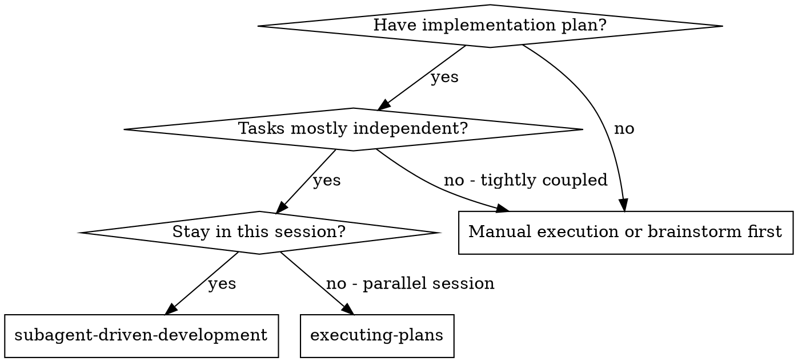
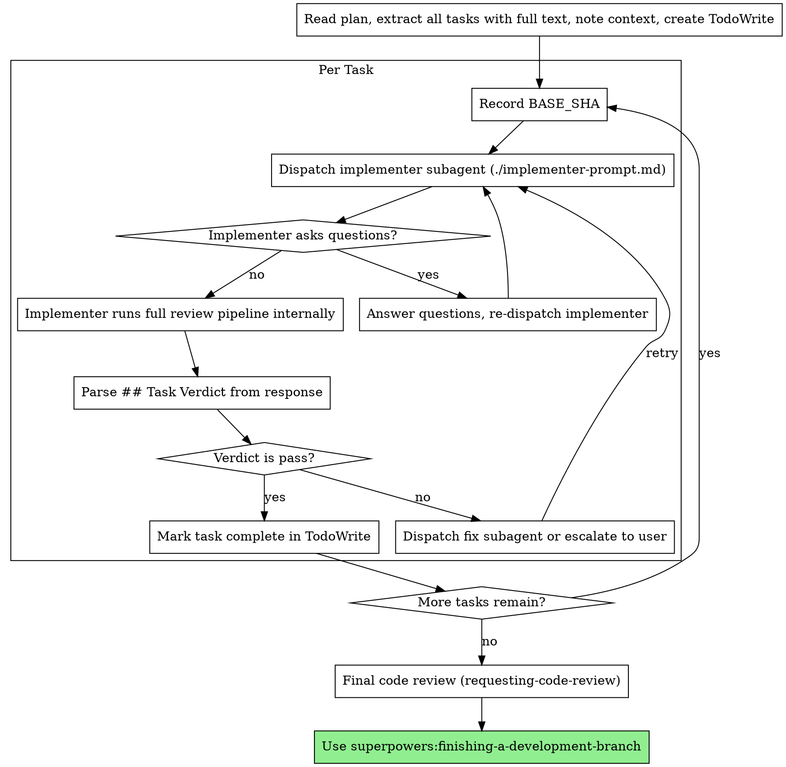

# Subagent-Driven Development

Execute plan by dispatching fresh subagent per task. Each subagent handles implementation + full review pipeline (self-review, Codex, spec compliance, code quality) and reports a structured verdict.

**Core principle:** Fresh subagent per task with self-contained review pipeline = high quality, minimal main session context

## When to Use



**vs. Executing Plans (parallel session):**
- Same session (no context switch)
- Fresh subagent per task (no context pollution)
- Implementer handles full review pipeline internally (minimal main session context)
- Faster iteration (no human-in-loop between tasks)

## Model Configuration

| Role | Default | Overridable | Rationale |
|------|---------|-------------|-----------|
| **Implementer** | **Inherits from session** | **Yes** | User controls cost/quality tradeoff |
| Spec compliance reviewer | Opus | No | Deep analysis needs strongest model |
| Code quality reviewer | Opus | No | Deep analysis needs strongest model |
| Codex reviewer | Sonnet | No | Relay to Codex MCP, lightweight |

**Model override:** Include a model preference in your prompt when invoking this skill. Examples:
- "execute this plan using sonnet for implementers"
- "run with sonnet model"

The override applies to the implementer only. Review subagents always use their fixed models.

## Codex Integration

> See `lib/codex-integration.md` for Codex patterns. The implementer subagent dispatches codex-agent directly via the Task tool — no persistent teammate needed.

## The Process

### Recover Context (Before Starting)

Check for session breadcrumbs left by `writing-plans`. This enables `/clear` between planning and execution without losing state:

```bash
MAIN_REPO="$(cd "$(git rev-parse --git-common-dir)/.." && pwd)"
PLAN_BREADCRUMB="$MAIN_REPO/.codex-state/current_plan"
WORKTREE_BREADCRUMB="$MAIN_REPO/.codex-state/current_worktree"
```

**If breadcrumbs exist** (post-`/clear` or new session):
1. Read the worktree path from `$WORKTREE_BREADCRUMB` and `cd` into it
2. Read the plan file path from `$PLAN_BREADCRUMB`
3. Load and parse the plan file

> Breadcrumbs persist in `.codex-state/` — other skills (Codex agent, requesting-code-review) reference them downstream. Cleanup happens in `finishing-a-development-branch`.

**If breadcrumbs do not exist** (same-session handoff from `writing-plans`):
- The plan is already in context from the current session
- Ask the user for the plan file path if it is not in context

### Parse Model Override

Check the user's prompt for a model preference. Look for patterns like "use sonnet", "using sonnet for implement", "with sonnet", etc.

- **If found:** Set `work_model` to the specified model (e.g., "sonnet", "haiku")
- **If not found:** Leave `work_model` unset (implementer inherits from session)

This only affects the implementer. Review subagents (spec, quality, codex) use fixed models regardless.

### Verify Worktree

Check if inside a git worktree (`git worktree list`). If NOT in a worktree, dispatch the `worktree-setup` agent (see `agents/worktree-setup.md`) with the branch name. The agent runs on Sonnet and handles the full setup.

### Per-Task Workflow



## Per-Task Dispatch

For each task, the main session:

### Step 1: Record BASE_SHA

```bash
BASE_SHA=$(git rev-parse HEAD)
```

### Step 2: Determine CODEX_STATUS

- Start with `codex_status = "available"`
- If a previous task's verdict reported `codex_review.status: unavailable`, set `codex_status = "unavailable"` for all subsequent tasks

### Step 3: Dispatch Implementer

Fill the template from `./implementer-prompt.md` with these 7 inputs:

| Variable | Source |
|----------|--------|
| `{TASK_NUMBER}` | Task index from plan |
| `{TASK_NAME}` | Task title from plan |
| `{TASK_TEXT}` | Full task text from plan (paste, don't reference file) |
| `{CONTEXT}` | Scene-setting: where this fits, dependencies, architecture |
| `{WORKING_DIRECTORY}` | Worktree absolute path |
| `{BASE_SHA}` | From Step 1 |
| `{CODEX_STATUS}` | From Step 2 |

Dispatch via Task tool (`subagent_type: "general-purpose"`). If `work_model` is set, add `model: "{work_model}"` to the Task tool call.

The implementer handles the full review pipeline internally (self-review → Codex → spec compliance → code quality) and returns a `## Task Verdict`. Review subagents dispatched by the implementer use fixed models (opus for spec/quality, sonnet for codex) regardless of the implementer's model.

## Parsing the Task Verdict

Scan the implementer's response for `## Task Verdict`. Extract:

- **`verdict`**: `pass` or `fail`
- **`head_sha`**: The commit after all implementation and fixes
- **`codex_review.status`**: `available` or `unavailable` — propagate to subsequent tasks
- **`concerns`**: Non-blocking risks worth noting

**If `verdict: pass`:**
- Mark task complete in TodoWrite
- Proceed to next task

**If `verdict: fail`:**
- Check `unresolved` fields for specifics
- Dispatch a fix subagent with the specific unresolved issues, or escalate to user
- Don't try to fix manually (context pollution)

**If `concerns` is non-empty:**
- Report concerns to user but continue

**If `codex_review.status: unavailable`:**
- Set `codex_status = "unavailable"` for remaining tasks
- Inform user that Codex review was skipped

## Final Code Review

After all tasks complete, request a final code review of the entire implementation.

**REQUIRED SUB-SKILL:** Use superpowers:requesting-code-review with:
- Full branch diff (`git diff main...HEAD` or equivalent)
- The design doc (read from `.codex-state/current_design_doc`)
- The implementation plan filename
- Test results summary

The code review skill handles both the subagent review and the Codex review gate. Only proceed to `finishing-a-development-branch` after the review passes.

## Prompt Templates

- `./implementer-prompt.md` — Dispatch implementer subagent (handles full review pipeline internally)
- `./spec-reviewer-prompt.md` — Spec compliance reviewer (dispatched by implementer, not main session)
- `./code-quality-reviewer-prompt.md` — Code quality reviewer (dispatched by implementer, not main session)

## Example Workflow

```
You: I'm using Subagent-Driven Development to execute this plan.

[Read plan file once: docs/plans/feature-plan.md]
[Extract all 5 tasks with full text and context]
[Create TodoWrite with all tasks]
[Set codex_status = "available"]

Task 1: Hook installation script
BASE_SHA=$(git rev-parse HEAD)

[Dispatch implementer subagent with full task text + context + BASE_SHA + codex_status]

Implementer: "Before I begin - should the hook be installed at user or system level?"

You: "User level (~/.config/superpowers/hooks/)"

[Re-dispatch implementer with answer]

[Implementer runs full pipeline internally:
  - Implements, tests, commits
  - Self-review: finds missed --force flag, fixes
  - Codex review: pass (1 false positive dismissed)
  - Spec compliance: pass
  - Code quality: pass]

## Task Verdict
task: 1
verdict: pass
base_sha: abc1234
head_sha: def5678
implementation_summary: Hook installation script with --force flag
codex_review:
  status: available
  rounds: 1
  thread_id: thread_abc123
  findings_fixed: 0
spec_compliance: pass (round 1)
code_quality: pass (round 1)
tests: 5/5 passing
concerns: none

[Mark Task 1 complete]

Task 2: Recovery modes
BASE_SHA=$(git rev-parse HEAD)
[Dispatch implementer...]
...

[After all tasks]
[Request final code review via requesting-code-review skill]
[Final review passes]

Done!
```

## Red Flags

**Never:**
- Start implementation on main/master branch without explicit user consent
- Dispatch multiple implementation subagents in parallel (conflicts)
- Make subagent read plan file (provide full text instead)
- Skip scene-setting context (subagent needs to understand where task fits)
- Ignore subagent questions (answer before letting them proceed)
- Dispatch spec/quality reviewers from the main session (implementer handles them internally)
- Skip parsing `## Task Verdict` (always parse and act on the verdict)
- Ignore `codex_review.status` changes in the verdict (propagate to subsequent tasks)
- Start final code review before all tasks are complete
- Move to next task while verdict is `fail`

**If subagent asks questions:**
- Answer clearly and completely
- Provide additional context if needed
- Re-dispatch with the answer

**If verdict is `fail`:**
- Dispatch fix subagent with specific unresolved issues
- Don't try to fix manually (context pollution)

## Integration

**Required workflow skills:**
- **worktree-setup agent** - REQUIRED: Set up isolated workspace before starting. Dispatch `agents/worktree-setup.md` (runs on Sonnet, keeps setup out of context window).
- **superpowers:writing-plans** - Creates the plan this skill executes
- **superpowers:requesting-code-review** - Final review (subagent + Codex) for entire implementation
- **superpowers:finishing-a-development-branch** - Complete development after all tasks

**Subagents should use:**
- **superpowers:test-driven-development** - Subagents follow TDD for each task

**Alternative workflow:**
- **superpowers:executing-plans** - Use for parallel session instead of same-session execution
