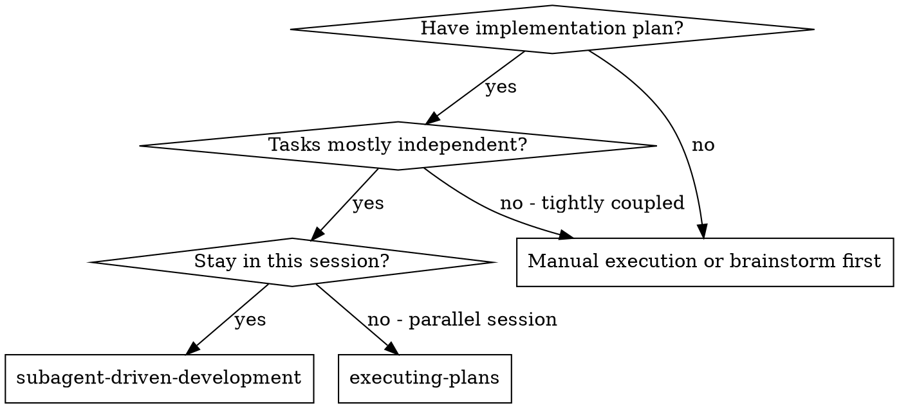
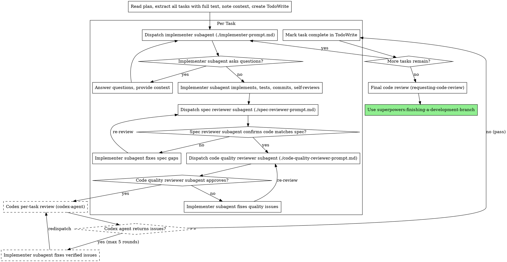

# Subagent-Driven Development

Execute plan by dispatching fresh subagent per task, with three-stage review after each: spec compliance, code quality, then Codex review.

**Core principle:** Fresh subagent per task + three-stage review (spec, quality, Codex) = high quality, fast iteration

## When to Use



**vs. Executing Plans (parallel session):**
- Same session (no context switch)
- Fresh subagent per task (no context pollution)
- Three-stage review after each task: spec compliance, code quality, then Codex
- Faster iteration (no human-in-loop between tasks)

## Codex Integration

> **Reference:** See `lib/codex-integration.md` for shared patterns (state directory, availability, review gate logic, working directory awareness, cleanup).
>
> **All Codex interactions go through the `codex-agent` subagent** (`agents/codex-agent.md`). This preserves the main session's context window. See `lib/codex-integration.md` "Codex Agent (Preferred Pattern)" for dispatch format.

Thread management is handled by the codex-agent automatically — it reads the thread ID from `.codex-state/codex_thread_id`, validates it, and recovers if expired. You do not need to manage the thread ID directly.

## The Process



## Per-Task Codex Review

> **Reference:** See `lib/codex-integration.md` for shared patterns (review gate logic, availability).

After the code quality reviewer approves, ensure changes are committed, then dispatch codex-agent with `mode: review-gate` for a third opinion. This catches cross-cutting issues that subagent reviewers miss because they lack project-wide context.

**Important:** The implementer subagent should have already committed as part of its workflow. Verify with `git status` — if uncommitted changes remain, commit them before dispatching the codex-agent.

**What to include in the review-gate message** (see `lib/codex-integration.md` "Efficient Codex Communication"):
- The commit SHA(s) covering the task — NOT the raw diff text
- A short summary of what was implemented and the task spec
- Test results summary (pass/fail counts)

Also provide `worktree_path` if working in a worktree.

**Review gate loop:** If the codex-agent returns `fail` with verified issues, fix them and redispatch (max 5 rounds). The agent filters out false positives, so only real issues come back. If passing with unresolved flags, append them to `docs/unresolved-flags.md` and commit (see `lib/codex-integration.md` for format).

**If codex-agent reports `status: unavailable`:** Skip this step and proceed with the subagent results only. Inform the user that Codex per-task review was skipped.

> Dashed nodes in the process diagram are skipped when Codex is unavailable.

## Final Code Review

After all tasks complete, request a final code review of the entire implementation.

**REQUIRED SUB-SKILL:** Use superpowers:requesting-code-review with:
- Full branch diff (`git diff main...HEAD` or equivalent)
- The design doc (read from `.codex-state/current_design_doc`)
- The implementation plan filename
- Test results summary

The code review skill handles both the subagent review and the Codex review gate. Only proceed to `finishing-a-development-branch` after the review passes.

## Prompt Templates

- `./implementer-prompt.md` - Dispatch implementer subagent
- `./spec-reviewer-prompt.md` - Dispatch spec compliance reviewer subagent
- `./code-quality-reviewer-prompt.md` - Dispatch code quality reviewer subagent

## Example Workflow

```
You: I'm using Subagent-Driven Development to execute this plan.

[Read plan file once: docs/plans/feature-plan.md]
[Extract all 5 tasks with full text and context]
[Create TodoWrite with all tasks]

Task 1: Hook installation script

[Get Task 1 text and context (already extracted)]
[Dispatch implementation subagent with full task text + context]

Implementer: "Before I begin - should the hook be installed at user or system level?"

You: "User level (~/.config/superpowers/hooks/)"

Implementer: "Got it. Implementing now..."
[Later] Implementer:
  - Implemented install-hook command
  - Added tests, 5/5 passing
  - Self-review: Found I missed --force flag, added it
  - Committed

[Dispatch spec compliance reviewer]
Spec reviewer: Spec compliant - all requirements met, nothing extra

[Get git SHAs, dispatch code quality reviewer]
Code reviewer: Strengths: Good test coverage, clean. Issues: None. Approved.

[Dispatch codex-agent with mode: review-gate]
  message: "Review abc1234..def5678. Implemented install-hook command.
   Tests: 5 passing."
  worktree_path: /path/.worktrees/hooks
Codex Agent Report: verdict=pass, 0 issues verified, 1 dismissed (false positive),
  codex_notes: "consider adding --dry-run flag for safety"

[Mark Task 1 complete]

Task 2: Recovery modes
...

[After all tasks]
[Request final code review via requesting-code-review skill]
  Code-reviewer subagent: All requirements met
  Codex agent: verdict=fail, 1 verified issue: missing input validation on recovery mode parameter
  [Fix: add validation]
  [Re-dispatch codex-agent]
  Code-reviewer subagent: Approved
  Codex agent: verdict=pass

Done!
```

## Advantages

**vs. Manual execution:**
- Subagents follow TDD naturally
- Fresh context per task (no confusion)
- Parallel-safe (subagents don't interfere)
- Subagent can ask questions (before AND during work)

**vs. Executing Plans:**
- Same session (no handoff)
- Continuous progress (no waiting)
- Review checkpoints automatic

**Efficiency gains:**
- No file reading overhead (controller provides full text)
- Controller curates exactly what context is needed
- Subagent gets complete information upfront
- Questions surfaced before work begins (not after)

**Quality gates:**
- Self-review catches issues before handoff
- Three-stage review: spec compliance, code quality, then Codex
- Codex per-task review catches cross-cutting issues subagents miss
- Final code review (requesting-code-review) catches cross-task issues
- Review loops ensure fixes actually work
- Spec compliance prevents over/under-building
- Code quality ensures implementation is well-built

**Cost:**
- More subagent invocations (implementer + 2 reviewers per task + Codex per task)
- Controller does more prep work (extracting all tasks upfront)
- Review loops add iterations
- Per-task Codex review + final Codex review adds token cost
- But catches issues early (cheaper than debugging later)

## Red Flags

**Never:**
- Start implementation on main/master branch without explicit user consent
- Skip reviews (spec compliance OR code quality OR Codex per-task OR final review)
- Proceed with unfixed issues
- Dispatch multiple implementation subagents in parallel (conflicts)
- Make subagent read plan file (provide full text instead)
- Skip scene-setting context (subagent needs to understand where task fits)
- Ignore subagent questions (answer before letting them proceed)
- Accept "close enough" on spec compliance (spec reviewer found issues = not done)
- Skip review loops (reviewer found issues = implementer fixes = review again)
- Let implementer self-review replace actual review (both are needed)
- **Start code quality review before spec compliance is approved** (wrong order)
- **Start Codex review before code quality is approved** (wrong order)
- **Start final code review before all tasks are complete** (wrong order)
- Move to next task while any review has open issues

**If subagent asks questions:**
- Answer clearly and completely
- Provide additional context if needed
- Don't rush them into implementation

**If reviewer finds issues:**
- Implementer (same subagent) fixes them
- Reviewer reviews again
- Repeat until approved
- Don't skip the re-review

**If subagent fails task:**
- Dispatch fix subagent with specific instructions
- Don't try to fix manually (context pollution)

## Integration

**Required workflow skills:**
- **worktree-setup agent** - REQUIRED: Set up isolated workspace before starting. Dispatch `agents/worktree-setup.md` (runs on Sonnet, keeps setup out of context window).
- **superpowers:writing-plans** - Creates the plan this skill executes
- **superpowers:requesting-code-review** - Final review (subagent + Codex) for entire implementation
- **superpowers:finishing-a-development-branch** - Complete development after all tasks

**Subagents should use:**
- **superpowers:test-driven-development** - Subagents follow TDD for each task

**Alternative workflow:**
- **superpowers:executing-plans** - Use for parallel session instead of same-session execution
